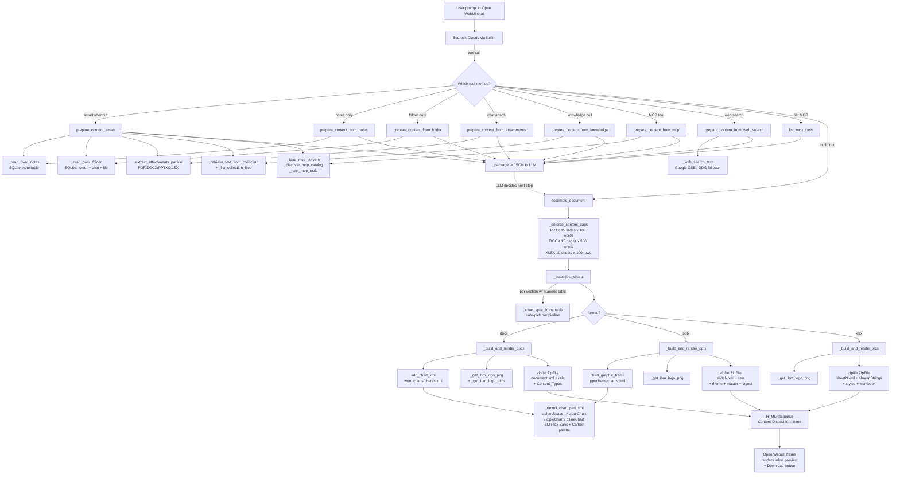
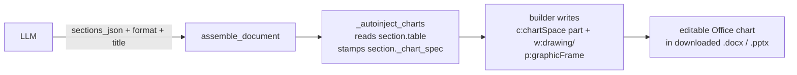

# IBM DocGen — End-to-End Flow (trimmed build, 4893 lines)

Derived by AST-walking `IBM_DocGen_WithImages_v2.py` from every public tool
entrypoint down to the OOXML zip writers. `_emit / _start_heartbeat /
_stop_heartbeat / _set_phase / _eta_for` are no-op stubs kept only for
backwards-compatible call sites and are not shown below.

## Key file paths written into each zip

| Artifact | DOCX | PPTX | XLSX |
|---|---|---|---|
| Content_Types | `[Content_Types].xml` (adds `drawingml.chart+xml` override per chart) | same | same |
| Package rels | `_rels/.rels` | `_rels/.rels` | `_rels/.rels` |
| Main part | `word/document.xml` | `ppt/presentation.xml` + `ppt/slides/slideN.xml` | `xl/workbook.xml` + `xl/worksheets/sheetN.xml` |
| Chart parts | `word/charts/chartN.xml` | `ppt/charts/chartN.xml` | (table-only, no chart in first release) |
| Media | `word/media/` | `ppt/media/` | n/a |
| Footer (page num) | `word/footer1.xml` | in every slide XML | sheet header |

## What the LLM emits vs. what the tool builds

The LLM's only output is a `sections_json` array + `format` + `title` +
`client_name`. For charts, it sets `section.table` (headers + numeric rows)
plus optional `chart_type: "bar" | "pie" | "line"`. The tool does the rest —
it never executes any Python code the LLM wrote.

