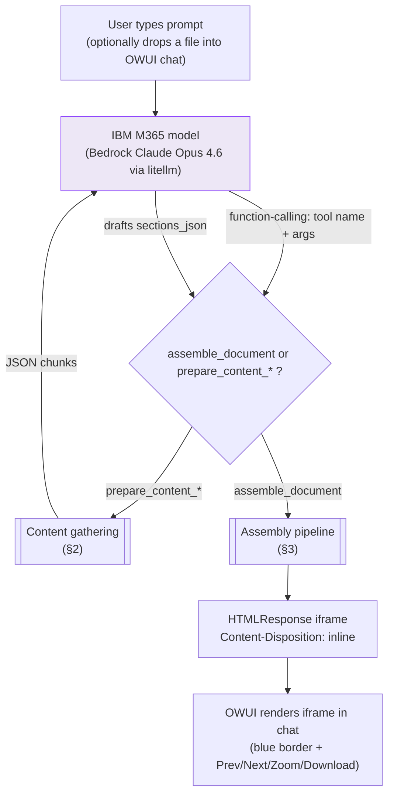
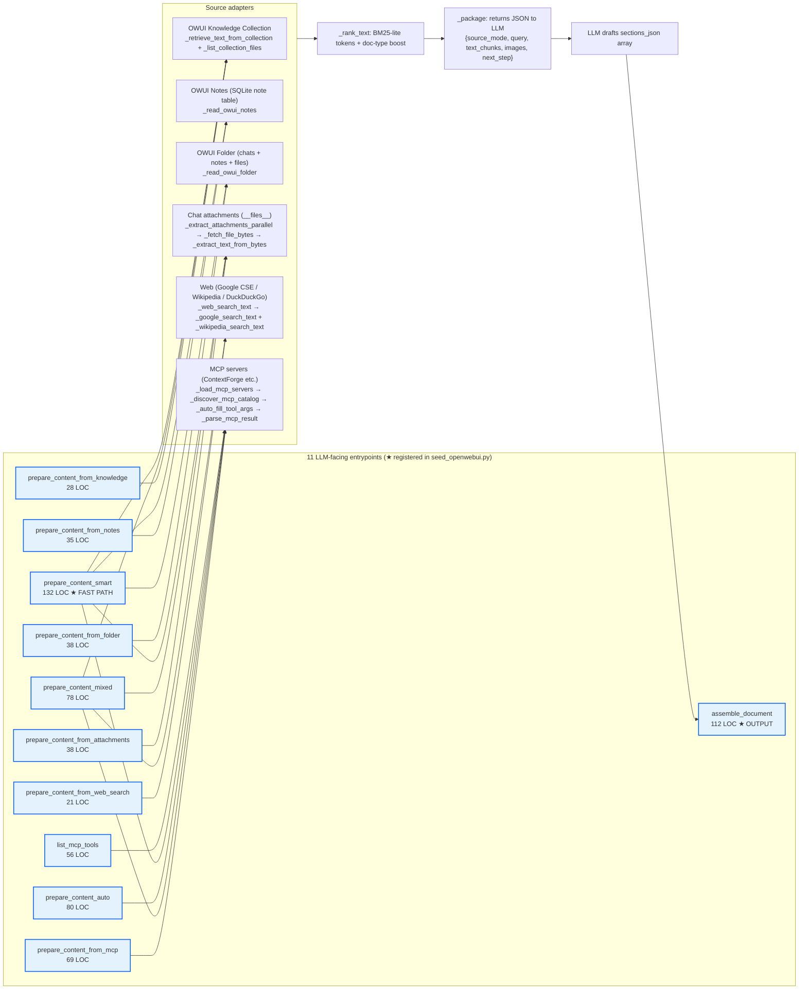
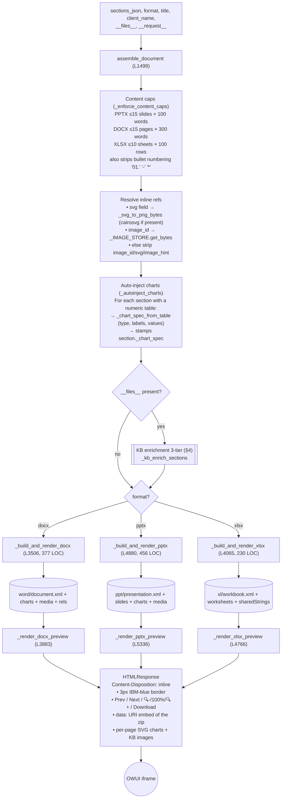
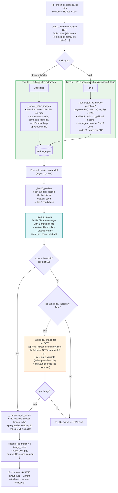
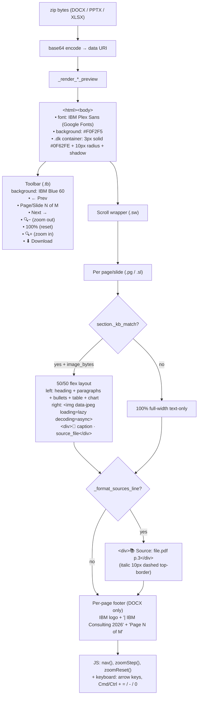
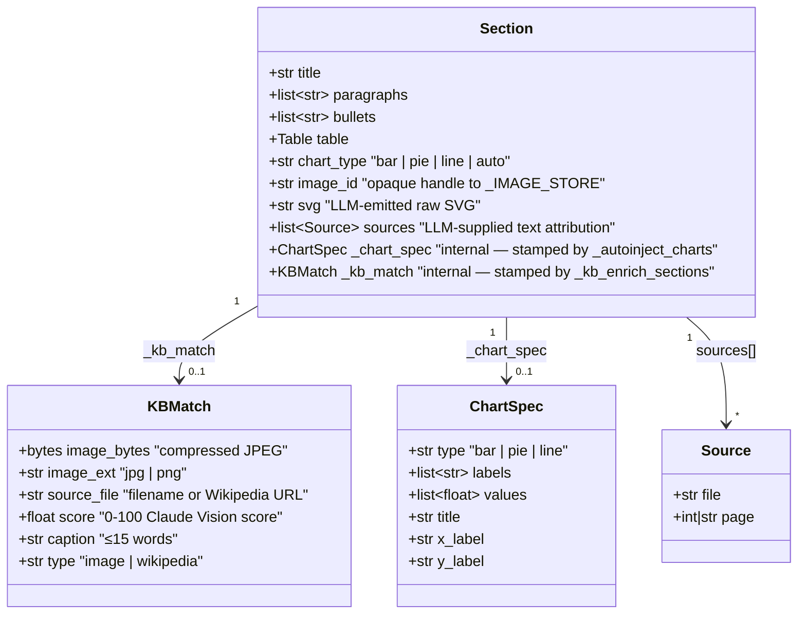
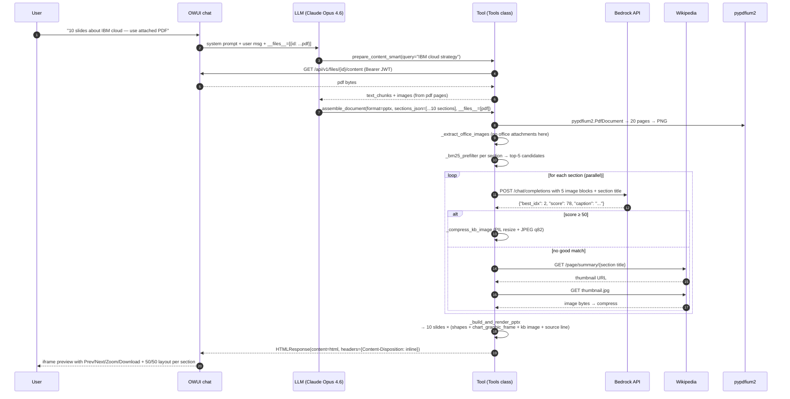

# IBM DocGen with Images — Full Runtime Flowchart

_Generated by AST-walking `IBM_DocGen_WithImages_v2.py` (5496 lines, 115 Tools methods, 11 LLM-facing entrypoints). Last synced: **2026-04-20**._

## 1. Top-level architecture (what happens when the user types a prompt)



## 2. Content gathering — 11 LLM-facing methods + what each reads



## 3. `assemble_document` pipeline — from `sections_json` to `HTMLResponse`



## 4. KB image enrichment — 3-tier fallback (the "wow" feature)



**Keys to read this:**

- **Tier 1a** always runs (if Office attachment present). Cheap, zero-deps.
- **Tier 1b** only fires if `pypdfium2` or `fitz` is importable on the runtime Python. Both on localhost. Usually absent on Beta — that tier silently no-ops.
- **Claude Vision rank** (Plan C) is the gate. Scores 0-100, threshold default **50** (user-tuned from initial 95).
- **Tier 3 Wikipedia** only fires when Plan C produced nothing above threshold.
- Final `section._kb_match` drives the 50/50 layout in both builders AND the HTML iframe.

## 5. Native OOXML chart pipeline (`_chart_spec` → `c:chartSpace`)

```mermaid
flowchart LR
    T[section.table<br/>{headers, rows}] --> HN["_table_has_numeric_column<br/>(≥70% numeric in one column)"]
    HN -->|yes| CS["_chart_spec_from_table<br/>detects bar / pie / line via:<br/>• header contains 'year/month/Q1..' → line<br/>• header contains '%/share/mix' → pie<br/>• else → bar"]

    CS --> SPEC["chart spec dict:<br/>{type, labels, values, title,<br/>x_label, y_label, series_name}"]

    SPEC --> AJC["_autoinject_charts stamps<br/>section._chart_spec"]

    AJC --> DUAL{2 render paths}
    DUAL --> O["_ooxml_chart_part_xml<br/>• c:chartSpace wrapper<br/>• c:barChart / c:pieChart / c:lineChart<br/>• IBM Carbon 9-color dPts<br/>• IBM Plex Sans in titles & axes<br/>→ word/charts/chartN.xml or ppt/charts/chartN.xml<br/>+ Content_Types override<br/>+ rel to graphicFrame"]
    DUAL --> S["_svg_chart_from_spec<br/>pure-string SVG for HTML iframe preview<br/>• IBM Carbon palette<br/>• value labels + axis titles<br/>• no PIL, no cairo"]

    O -->|DOCX| WD["&lt;w:drawing>&lt;a:graphic>&lt;c:chart r:id=&quot;rIdChartN&quot;/>"]
    O -->|PPTX| PG["&lt;p:graphicFrame>&lt;a:graphic>&lt;c:chart r:id=&quot;rIdN&quot;/>"]

    S --> IFR[HTML iframe SVG inline]
```

## 6. Preview rendering — HTML iframe structure (DOCX / PPTX)



## 7. Key data structures



## 8. Valve summary (tunable knobs)

| Valve | Default | What it controls |
|---|---|---|
| `enable_kb_vision_layout` | True | Turn the whole 50/50 KB feature on/off |
| `kb_vision_score_threshold` | **50** | Min Claude Vision score to accept a KB image. Raise for stricter, lower for more images |
| `kb_max_candidates_per_section` | 5 | How many BM25-top candidates to send to Claude Vision per section |
| `kb_plan_b_enabled` | True | Try Anthropic native PDF document block first (falls through if Bedrock rejects) |
| `kb_image_max_dim` | 1000 px | Longest-edge cap after resize |
| `kb_image_jpeg_quality` | 82 | JPEG Q after resize (clamped 40-95) |
| `kb_preview_lazy_hydration` | True | `` browser hints |
| `kb_wikipedia_fallback` | True | Tier 3 Wikipedia REST fetch when KB empty |
| `kb_wikipedia_timeout` | 5 s | Per-call Wikipedia timeout |
| `vision_rank_model` | `claude-opus-4-6` | Bedrock Claude via litellm |
| `disable_image_enrichment` | True | Legacy web-image enrichment killswitch (panic button) |

## 9. File-size / scale summary

| Artefact | Current size |
|---|---|
| Tool source (`IBM_DocGen_WithImages_v2.py`) | **5496 LOC** |
| Public LLM-facing methods | **11** (all registered in `seed_openwebui.py` specs) |
| Private helpers | **104** |
| Biggest method | `_build_and_render_pptx` (456 LOC) |
| Biggest public method | `prepare_content_smart` (132 LOC) |
| OOXML chart part XML | ~125 LOC in `_ooxml_chart_part_xml` |
| SVG chart renderer | ~123 LOC in `_svg_chart_from_spec` |
| System prompt | **38,812 chars** (`system_prompt.txt`) |

## 10. Cradle-to-grave example: "make a 10-slide PPTX about IBM cloud + include my PDF"



---

**Generated from live AST walk of the tool source. All method locations, LOC counts, and call relationships are accurate as of commit `661c24c` (tool `5496 lines`).**
